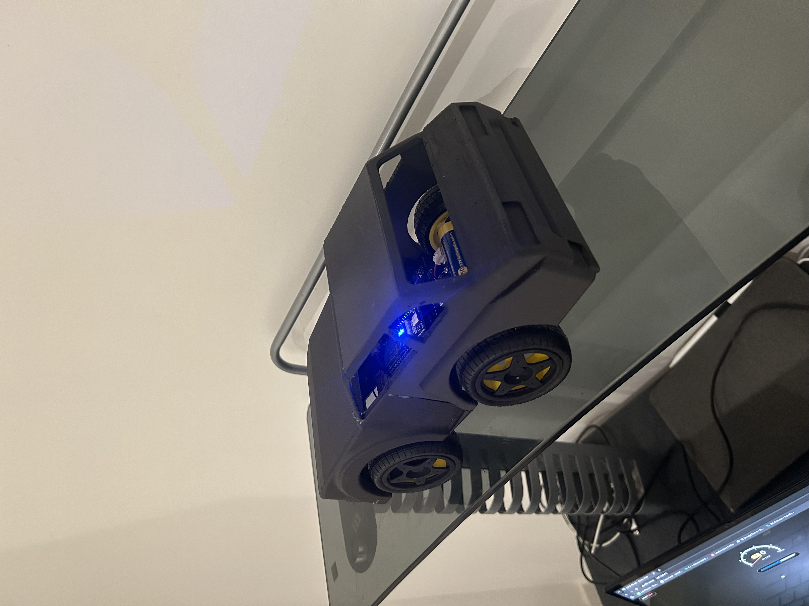
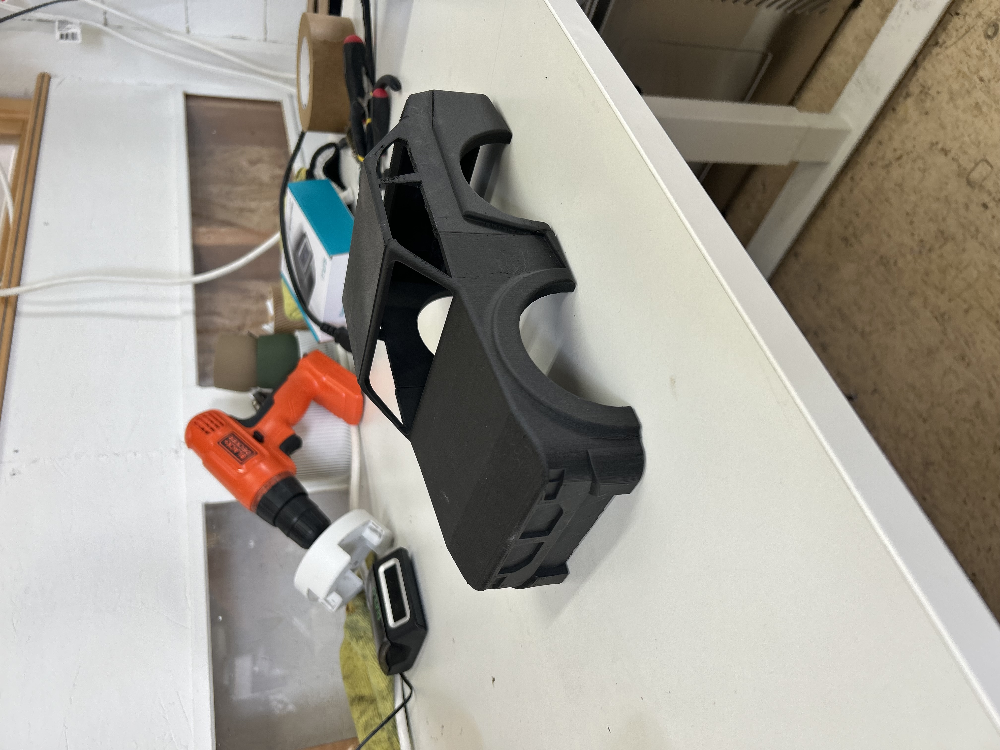
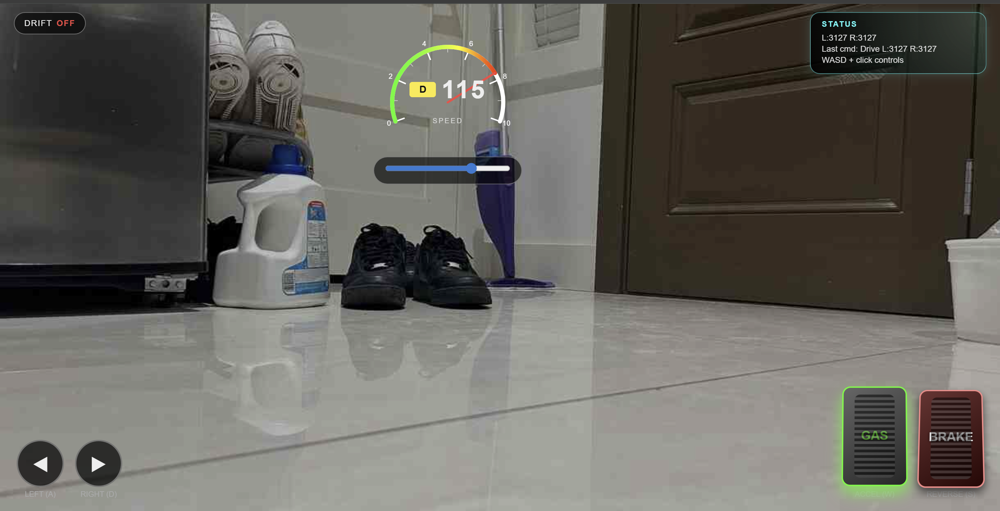

# BMW M2 RC Car

An ESP32 based RC vehicle inspired by the BMW M2 Competition, combining mechanical design, embedded motor control, and a game style web dashboard into a single mechatronics system.

---

## 🔧 Technical Overview

- Designed a custom BMW M2 inspired chassis in SolidWorks, accounting for motor mounting, steering geometry, electronics placement, and manufacturability.
- Implemented smooth DC motor drive and steering control using an ESP32, H bridge motor drivers, and PWM based control logic programmed in Arduino C++.
- Developed an ESP32 hosted web dashboard using HTML, CSS, and JavaScript for real time wireless vehicle control.
- Integrated ultrasonic based obstacle detection directly into the motor control logic to automatically prevent collisions during forward motion.

---

## ⚙️ Key Features

- Independent left and right motor control with real time differential steering and smooth acceleration and braking behavior.
- Fail safe stop logic that halts the vehicle when control input is released or connection is lost.
- Ultrasonic obstacle detection that continuously monitors distance ahead and blocks forward motion within a safety threshold.
- ESP32 hosted game style dashboard with live speed visualization, steering indicators, drive state feedback, and pedal style controls.
- Drift mode toggle that increases steering aggressiveness and is reflected visually in the dashboard.
- Modular ESP32 CAM integration providing live video feedback without impacting motor responsiveness.
- Lightweight non blocking networking architecture using REST style endpoints for control and telemetry.

---

## 📸 Project Media

  
  

  

  <i>BMW M2 inspired exterior, SolidWorks chassis design, and full screen web based control dashboard</i>

---

## 🎥 Video Demonstration

The video below shows live driving, dashboard interaction, steering response, and integrated obstacle detection.

▶ **Watch the RC Car Demonstration Video**  
https://drive.google.com/file/d/1aE3MejNEvwfQ_U80hKvikGiKrMmLiO1q/view?usp=sharing

---

## 🧠 System Architecture

- Mechanical  
  SolidWorks CAD chassis designed for compact packaging and structural rigidity

- Embedded  
  ESP32 microcontroller handling motor control, sensing, networking, and camera streaming

- Software  
  Modular C++ codebase developed using VS Code and PlatformIO with separation between vehicle control, dashboard logic, and camera handling

- Networking  
  ESP32 configured as a self contained Wi Fi access point with HTTP endpoints for control, telemetry, and video streaming

---

## 🚀 Future Improvements

- Closed loop speed control using wheel encoders  
- Vision based obstacle detection using the onboard camera  
- Autonomous navigation behaviors built on existing safety logic  
- Mobile optimized dashboard layout  
