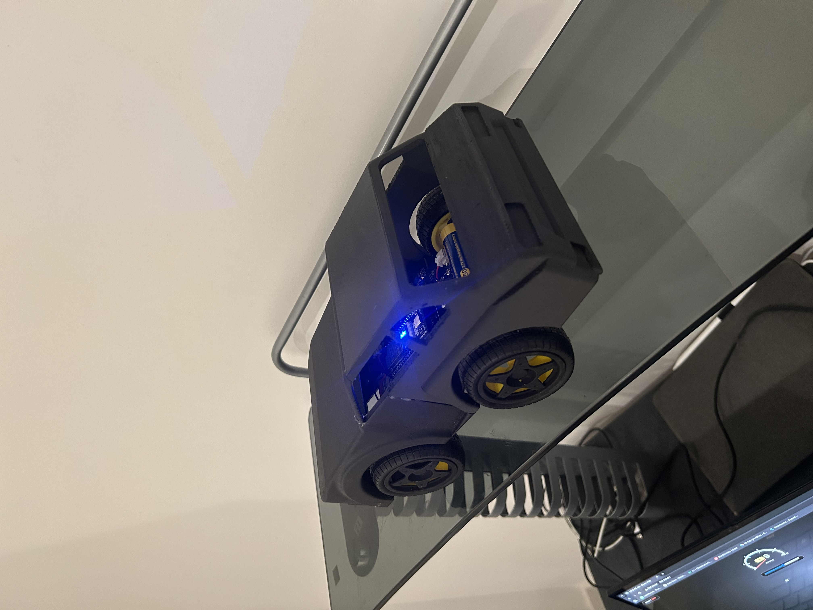
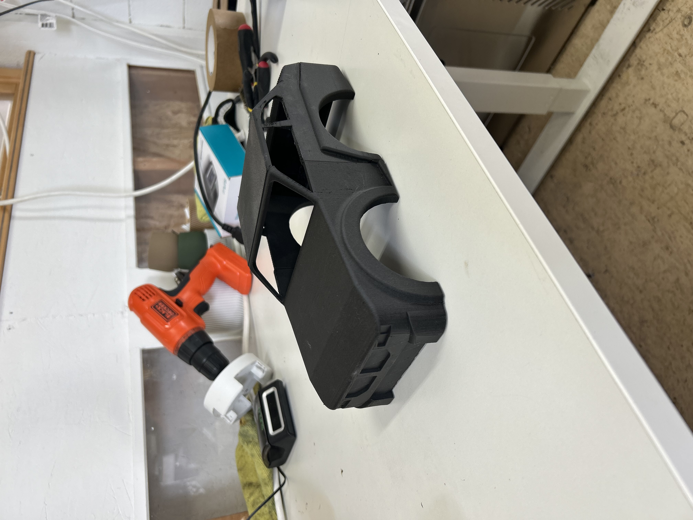
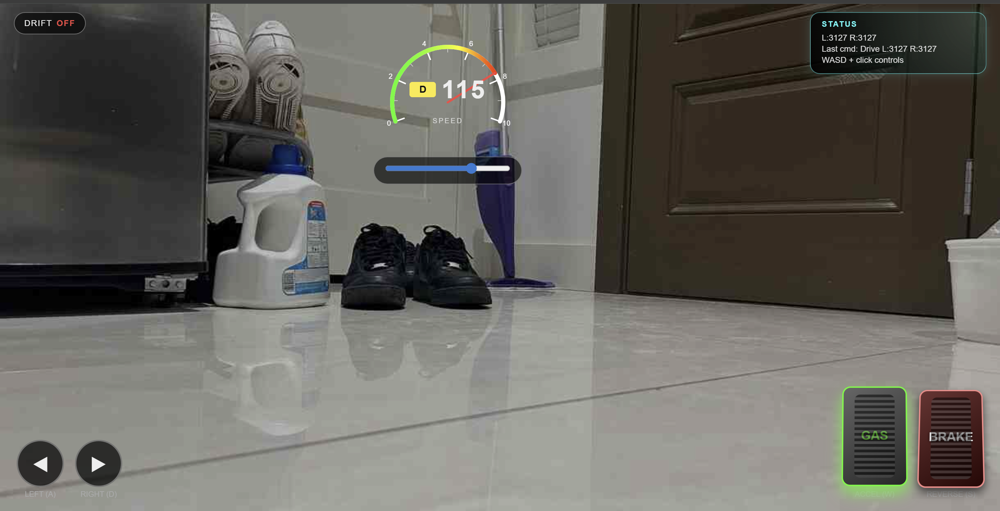

# BMW M2 RC Car

An ESP32-based RC vehicle inspired by the BMW M2 Competition, combining mechanical design, embedded motor control, and a game-style web dashboard into a single mechatronics system.

---

## 🔧 Technical Overview

- Designed a custom BMW M2-inspired chassis in SolidWorks, accounting for motor mounting, steering geometry, electronics placement, and manufacturability, then validated the structure with FEA before printing.
- Implemented dual DC motor drive and steering servo control using an ESP32, H-bridge motor drivers, and PWM control logic programmed in Arduino C++.
- Added a torque vectoring layer that biases drive torque between the left and right motors based on steering input, tightening corner entry without a mechanical differential.
- Implemented regenerative braking that shorts the motor terminals through the H-bridge under deceleration, recovering energy back into the pack instead of coasting or hard-braking.
- Developed an ESP32-hosted web dashboard using HTML, CSS, and JavaScript for real-time wireless vehicle control and live telemetry.
- Integrated ultrasonic obstacle detection directly into the motor control loop to automatically prevent collisions during forward motion.
  
---

## ⚙️ Key Features

- Independent left and right motor control with real-time differential steering and smooth acceleration and braking behaviour.
- Steering-dependent torque vectoring, with the bias curve exposed as a tunable parameter rather than hardcoded.
- Regenerative braking on throttle release and on brake input, with the recovered current visible live on the dashboard.
- Fail-safe stop logic that halts the vehicle when control input is released or the connection is lost.
- Ultrasonic obstacle detection that continuously monitors distance ahead and blocks forward motion within a safety threshold.
- ESP32-hosted, game-style dashboard with live speed visualization, steering indicators, drive state feedback, and pedal-style controls.
- Drift mode toggle that increases steering aggressiveness and relaxes the torque bias, reflected visually in the dashboard.
- Modular ESP32-CAM integration providing live video feedback without impacting motor responsiveness.
- Lightweight, non-blocking networking architecture using REST-style endpoints for control and telemetry.

---

## 📸 Project Media

  
  

  

  <i>BMW M2 inspired exterior, SolidWorks chassis design, and full screen web based control dashboard</i>

---

## 🎥 Video Demonstration

The video below shows live driving, dashboard interaction, steering response, and integrated obstacle detection.

▶ **Watch the RC Car Demonstration Video**  
https://drive.google.com/file/d/1aE3MejNEvwfQ_U80hKvikGiKrMmLiO1q/view?usp=sharing

---

## 🧠 System Architecture

- Mechanical  
  SolidWorks CAD chassis designed for compact packaging and structural rigidity, checked under load with FEA and printed in-house.

- Embedded  
  ESP32 microcontroller handling motor control, torque distribution, regenerative braking, sensing, networking, and camera streaming.

- Software  
  Modular C++ codebase developed in VS Code with PlatformIO, separating vehicle control, torque and brake logic, dashboard logic, and camera handling.

- Networking  
  ESP32 configured as a self-contained Wi-Fi access point with HTTP endpoints for control, telemetry, and video streaming.

---

## 🚀 Future Improvements

- Closed-loop speed control using wheel encoders, which would also let the regen braking target a set deceleration rate instead of a fixed duty.
- Vision-based obstacle detection using the onboard camera.
- Autonomous navigation behaviours built on the existing safety logic.
- Mobile-optimized dashboard layout.  
